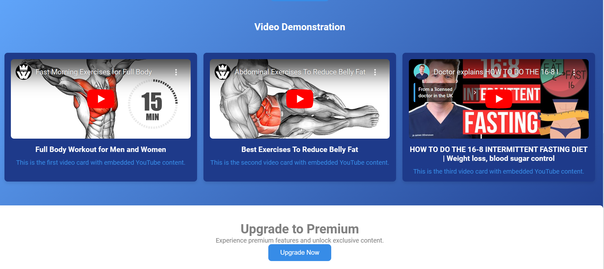

# Fitnepal




## Setup Instructions

Follow these steps to set up the project on your local machine:

### Step 1: Create Folder in htdocs
1. Navigate to the `htdocs` directory of your local web server (e.g., XAMPP).
2. Create a new folder for the project.

### Step 2: Open the Folder in VS Code
1. Open Visual Studio Code (VS Code).
2. Select `File > Open Folder` and choose the folder you created in Step 1.

### Step 3: Open Terminal in VS Code
1. In VS Code, open the terminal by selecting `Terminal > New Terminal`.

### Step 4: Clone the Repository
1. In the terminal, run the following command to clone the repository:
   ```sh
   git clone https://github.com/prasangapokharel/Fitnepal-Completed.git
   ```

### Step 5: Open PhpMyAdmin
1. Open your web browser and go to [PhpMyAdmin](http://localhost/phpmyadmin/).

### Step 6: Create Database
1. In PhpMyAdmin, create a new database named `fitness`.

### Step 7: Import Database
1. Select the `fitness` database.
2. Click on the `Import` tab.
3. Choose the `fitness.sql` file from the cloned repository and import it.

### Step 8: Done Successfully
1. Open your web browser and go to the following URL to access the application:
   ```sh
   http://localhost/foldername/home/index.php
   ```
   Replace `foldername` with the name of the folder you created in Step 1.

## Troubleshooting
If you encounter any issues, please make sure you have the necessary permissions and your local server is running correctly.

## License
This project is licensed under the MIT License - see the [LICENSE](LICENSE) file for details.

## Acknowledgments
- Thanks to everyone who contributed to this project.
